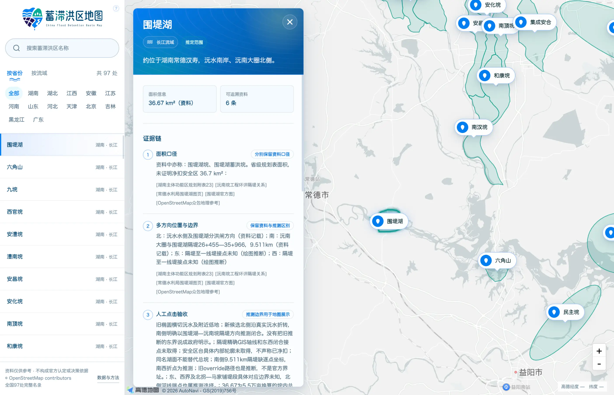

# 中国蓄滞洪区地图

网站地址：[https://hongqu.wayout.top/](https://hongqu.wayout.top/)

这是一个中国的蓄滞洪区地图项目，使用的是高德的 API。

### 什么是蓄滞洪区？

中国的蓄滞洪区，是在发生大洪水时，**临时用来分洪、蓄洪的指定区域，以牺牲局部空间换取城市、堤防和重要地区安全**。

**蓄滞洪区不是每年都会启用的“泄洪区”，而是防御极端洪水的最后一道底牌；过去十年，中国国家蓄滞洪区实际投入分洪约30多处次，其中绝大多数集中在2020、2021和2023年的几场特大洪水中。**

水利部发展研究中心资料显示，截至 2022 年 10 月，67 处共进行了 **423 次分洪运用**。来源：[水利部发展研究中心](https://www.waterinfo.com.cn/xsyj/zjgd/202410/t20241021_36612.html)。

### 蓄滞洪区赔偿

蓄滞洪区启用后，政府会按规定对居民的住房、农作物、养殖业及部分家庭财产损失给予补偿，同时受灾居民仍可享受一般洪灾救助。赔偿办法：[中华人民共和国司法部相关法规](https://xzfg.moj.gov.cn/front/law/detail?LawID=1773)

### 为什么要制作这个地图

偶然了解到蓄滞洪区，却找不到一张能直观看到它们位置和范围的地图，于是决定自己做一个。希望这张地图能让更多人了解蓄滞洪区，也能在有人需要查找相关信息时，提供一点帮助。

### 地图边界资料来源

以围堤湖为例：检索并交叉核对公开资料，归纳洪区的大致位置与自然边界，再绘制用于位置理解的推定范围。资料不足的闭合段会明确标记为绘图推断，不作为法定边界或测绘结果。

### 地图纠错

如果发现地图有误，或有更准确的位置、边界信息，欢迎提交 Issue，并附上相关资料来源，帮助完善这张地图。

### 重要

资料仅供参考 · 不构成官方认定或决策依据；所有范围均为资料推定，不是主管部门发布的法定边界。所有位置均未经实地核验。本工具不能替代洪水影响评价
